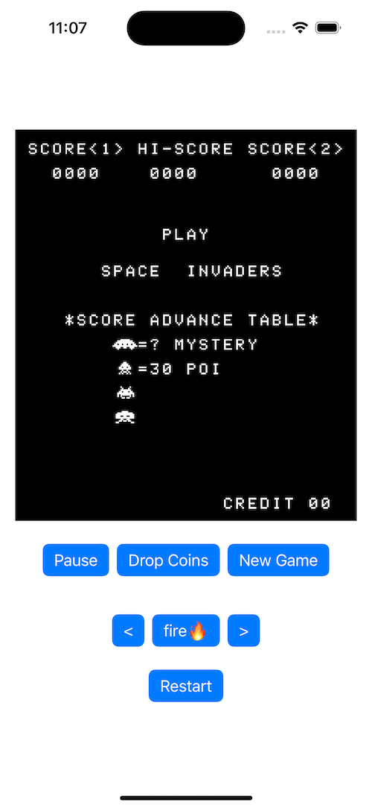

# SpaceInvaders
Space invaders implemented in Rust and Swift.

This repo contains both iOS and macOS application.

CPU engine is written in Rust [here](https://github.com/k0Iry/8080-Emulator-in-Rust).

To build, you need to obtain the Rust library and header file.

## Play(on macOS):

```
P => Pause or resume/start the game console

C => Drop a coin for player 1

S => Start a new game round

<- => Move left

-> => Move Right

Space => Fire!

R => Restart the whole game (this will erase all the game progress)
```


## Play(on iOS)

There are buttons to follow the controls.



Thanks to http://www.emulator101.com
