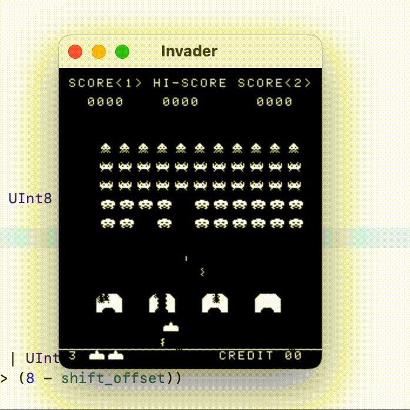

# SpaceInvaders
Space invaders implemented in Rust and Swift

CPU engine is written in Rust [here](https://github.com/k0Iry/8080-Emulator-in-Rust).

Play:

```
P => Pause or resume/start the game console

C => Drop a coin for player 1

S => Start a new game round

<- => Move left

-> => Move Right

Space => Fire!

1, 2, 3 => Scale the game screen to x1, x2, x3
```



Thanks to http://www.emulator101.com
