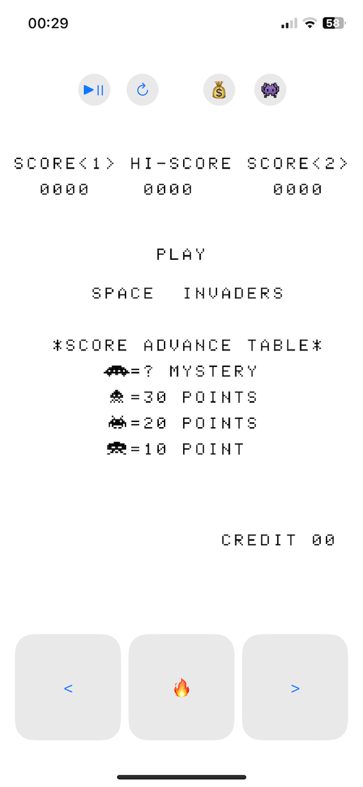

# SpaceInvaders
SpaceInvaders in SwiftUI.

This project mainly serves as a working DEMO for the 8080 emulation library in Rust [here](https://github.com/k0Iry/8080-Emulator-in-Rust).

It provides a way of using the Rust library.

## Play(on macOS):

```
P => Start or pause/resume the game console

C => Drop a coin for player 1

S => Start a new game round

<- => Move left

-> => Move Right

Space => Shoot

R => Restart the whole game (this will erase all the game progress)
```


## Play(on iOS)

There are buttons to follow the controls.




Thanks to [emulator101](http://www.emulator101.com).
